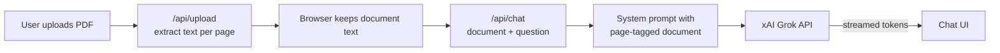

# DocuChat AI

> Chat with your documents. Upload a PDF and ask questions about it, with answers grounded in the document and page citations, powered by xAI Grok.


**Live demo:** _coming soon_ <!-- add your Vercel URL -->

<!-- Add a screenshot or GIF here:  -->

## Features

- 📄 Upload **PDF, TXT, or Markdown** files (drag & drop, up to 10 MB)
- 💬 Ask questions in a chat interface with **streaming responses**
- 📌 Answers cite **page numbers** and refuse to guess when the answer isn't in the document
- 👀 Side-by-side view of the extracted document text
- 🌗 Light/dark mode, responsive layout

## How it works (v0.1)



1. **Upload:** the server extracts text from each page with [`unpdf`](https://github.com/unjs/unpdf) and returns it to the browser.
2. **Ask:** the browser sends the document and the conversation to `/api/chat`.
3. **Ground:** the whole document goes into the system prompt, tagged with `[Page N]` markers, plus rules: answer only from the document, cite pages, say "I couldn't find that" instead of guessing.
4. **Stream:** Grok's response is streamed back token by token as plain text.

The server is **stateless**: no database and nothing stored, so it deploys anywhere (e.g. Vercel serverless).

### Known limitation → the motivation for v0.2

v0.1 uses *context stuffing*: the entire document goes into every request. That's simple and accurate for small docs, but:
- large documents exceed the model's context window (we truncate at `MAX_DOC_CHARS`)
- every question pays for the full document's tokens

**v0.2 replaces this with Retrieval-Augmented Generation (RAG):** chunk the document, embed the chunks, and send only the most relevant chunks for each question.

## Tech stack

| Layer | Choice | Why |
|---|---|---|
| Framework | Next.js (App Router) + TypeScript | UI and API routes in one deployable app |
| Styling | Tailwind CSS | Fast, consistent UI |
| LLM | xAI Grok via the `openai` SDK | xAI's API is OpenAI-compatible, so switching providers means changing only `baseURL` |
| PDF parsing | `unpdf` | Serverless-friendly PDF.js build, per-page text |
| CI | GitHub Actions | Lint, typecheck, and build on every PR |

## Getting started

```bash
git clone https://github.com/alokera/docuchat-ai.git
cd docuchat-ai
npm install
cp .env.example .env.local   # then add your XAI_API_KEY
npm run dev
```

Open http://localhost:3000.

| Variable | Description | Default |
|---|---|---|
| `XAI_API_KEY` | Your key from [console.x.ai](https://console.x.ai) | (required) |
| `XAI_MODEL` | Grok model name ([list](https://docs.x.ai/docs/models)) | `grok-4` |
| `MAX_DOC_CHARS` | Max document characters sent per request | `200000` |

## Project structure

```
src/
├── app/
│   ├── page.tsx              # Split view: document + chat
│   └── api/
│       ├── upload/route.ts   # File → per-page text
│       └── chat/route.ts     # Prompt building + streaming LLM response
├── components/               # UploadDropzone, DocumentPanel, ChatPanel, MessageBubble
└── lib/
    ├── llm.ts                # Provider client (xAI Grok)
    ├── parse.ts              # PDF/TXT/MD text extraction
    ├── prompt.ts             # Grounding system prompt
    └── types.ts
```

## Roadmap

- [x] **v0.1:** Upload, chat, streaming, page citations
- [ ] **v0.2:** RAG: chunking, embeddings, vector search, cited source snippets
- [ ] **v0.3:** Multiple documents, saved conversations, inline PDF viewer, auth
- [ ] Evaluation script comparing v0.1 vs v0.2 answer accuracy

## Challenges & learnings

<!-- Fill this in as you build. Interviewers love this section. Ideas:
- Why per-page extraction (enables citations)
- Prompting to reduce hallucinations
- Streaming from a route handler with ReadableStream
-->

## License

MIT
