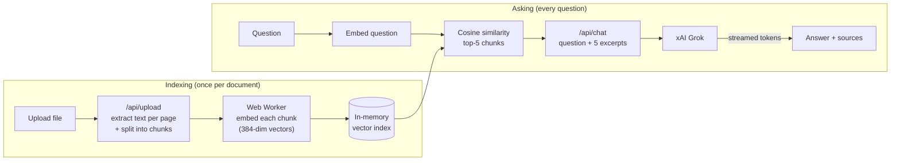

# DocuChat AI

> Chat with your documents. Upload a PDF and ask questions about it. Retrieval-augmented generation (RAG) finds the relevant passages, and xAI Grok answers with page citations.

**Live demo:** _coming soon_ <!-- add your Vercel URL -->

<!-- Add a screenshot or GIF here:  -->

## Features

- 📄 Upload **PDF, TXT, or Markdown** files (drag & drop, up to 10 MB)
- 🔎 **Retrieval-Augmented Generation (RAG):** only the passages relevant to your question are sent to the LLM
- 🧠 **In-browser embeddings** (`all-MiniLM-L6-v2` via transformers.js in a Web Worker): free, private, no extra API key
- 📌 Answers cite **page numbers**, show the **retrieved source snippets with similarity scores**, and jump to the page on click
- 💬 **Streaming responses**, with refusal to guess when the answer isn't in the document
- 🌗 Light/dark mode, responsive layout

## How it works (v0.2: RAG)



1. **Parse & chunk** (server): text is extracted per page with [`unpdf`](https://github.com/unjs/unpdf) and split into ~1,000-character chunks with 200 characters of overlap. Splits prefer paragraph and sentence boundaries, and a chunk never spans two pages, so every chunk has exactly one page number to cite.
2. **Embed** (browser): a Web Worker runs [`Xenova/all-MiniLM-L6-v2`](https://huggingface.co/Xenova/all-MiniLM-L6-v2) with [transformers.js](https://huggingface.co/docs/transformers.js) (WebAssembly, 8-bit quantized, ~23 MB, cached after the first download). Each chunk becomes a 384-dimensional, unit-length vector.
3. **Retrieve** (browser): the question is embedded with the same model and compared against every chunk with cosine similarity. The top 5 chunks are kept. Follow-ups like "tell me more" include the previous question so retrieval has context.
4. **Generate** (server): only those excerpts, tagged with page numbers, go into Grok's system prompt with grounding rules (answer only from the excerpts, cite pages, say "I couldn't find that" instead of guessing). The answer streams back token by token.

### Design decisions

- **Why embed in the browser?** The Node.js ONNX runtime is ~300 MB on Linux, which exceeds Vercel's 250 MB serverless function limit. Running the model in the browser keeps the server small and **stateless** (no database, nothing stored), costs nothing per embedding, and the document text never goes to a third-party embedding API.
- **Why brute-force search instead of a vector database?** One document is at most a few thousand chunks, and scoring all of them takes milliseconds. A vector database with an approximate-nearest-neighbour index (e.g. pgvector + HNSW) becomes worth it with many documents or persistence, which is planned for v0.3.
- **Why overlap chunks?** A fact that straddles a chunk boundary would otherwise be split in half and might not be retrieved in either piece.

### v0.1 → v0.2

v0.1 sent the *whole document* with every question (context stuffing). That works for small files, but large documents overflowed the context window and every question paid for every token. v0.2 sends ~5,000 characters of relevant excerpts regardless of document size.

## Tech stack

| Layer | Choice | Why |
|---|---|---|
| Framework | Next.js (App Router) + TypeScript | UI and API routes in one deployable app |
| Styling | Tailwind CSS | Fast, consistent UI |
| LLM | xAI Grok via the `openai` SDK | xAI's API is OpenAI-compatible, so switching providers means changing only `baseURL` |
| PDF parsing | `unpdf` | Serverless-friendly PDF.js build, per-page text |
| Embeddings | transformers.js + `all-MiniLM-L6-v2` (Web Worker) | Free, private, runs anywhere; no server-side ML runtime |
| Retrieval | Cosine similarity (hand-written) | Simple and fast at single-document scale |
| Testing | Vitest | Unit tests for chunking and retrieval |

## Getting started

```bash
git clone https://github.com/alokera/docuchat-ai.git
cd docuchat-ai
npm install
cp .env.example .env.local   # then add your XAI_API_KEY
npm run dev
```

Open http://localhost:3000. Run the tests with `npm test`.

| Variable | Description | Default |
|---|---|---|
| `XAI_API_KEY` | Your key from [console.x.ai](https://console.x.ai) | (required) |
| `XAI_MODEL` | Grok model name ([list](https://docs.x.ai/docs/models)) | `grok-4` |

## Project structure

```
src/
├── app/
│   ├── page.tsx              # Split view: document + chat
│   └── api/
│       ├── upload/route.ts   # File → per-page text → chunks
│       └── chat/route.ts     # Excerpts + question → streaming LLM response
├── components/               # UploadDropzone, DocumentPanel, ChatPanel, MessageBubble
└── lib/
    ├── chunk.ts              # Overlapping, boundary-aware text splitter
    ├── embed.worker.ts       # Web Worker running the embedding model
    ├── embedder.ts           # Promise-based client for the worker
    ├── retrieval.ts          # Cosine similarity + top-k search
    ├── llm.ts                # Provider client (xAI Grok)
    ├── parse.ts              # PDF/TXT/MD text extraction
    ├── prompt.ts             # Grounding system prompt
    └── types.ts
```

## Roadmap

- [x] **v0.1:** Upload, chat, streaming, page citations
- [x] **v0.2:** RAG: chunking, in-browser embeddings, vector search, cited source snippets
- [ ] **v0.3:** Multiple documents, persistent vector store (pgvector), saved conversations, inline PDF viewer, auth
- [ ] Hybrid search (keyword BM25 + vectors) and re-ranking
- [ ] Evaluation script comparing v0.1 vs v0.2 answer accuracy

## Challenges & learnings

<!-- Fill this in as you build. Interviewers love this section. Ideas:
- Why per-page extraction (enables citations)
- Prompting to reduce hallucinations
- Streaming from a route handler with ReadableStream
- Moving embeddings to the browser after hitting Vercel's function size limit
- Picking chunk size / overlap, and why follow-up questions retrieve poorly on their own
-->

## License

MIT
